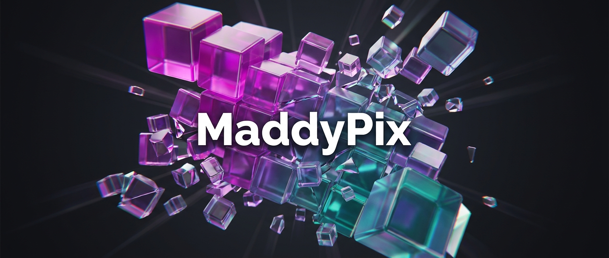
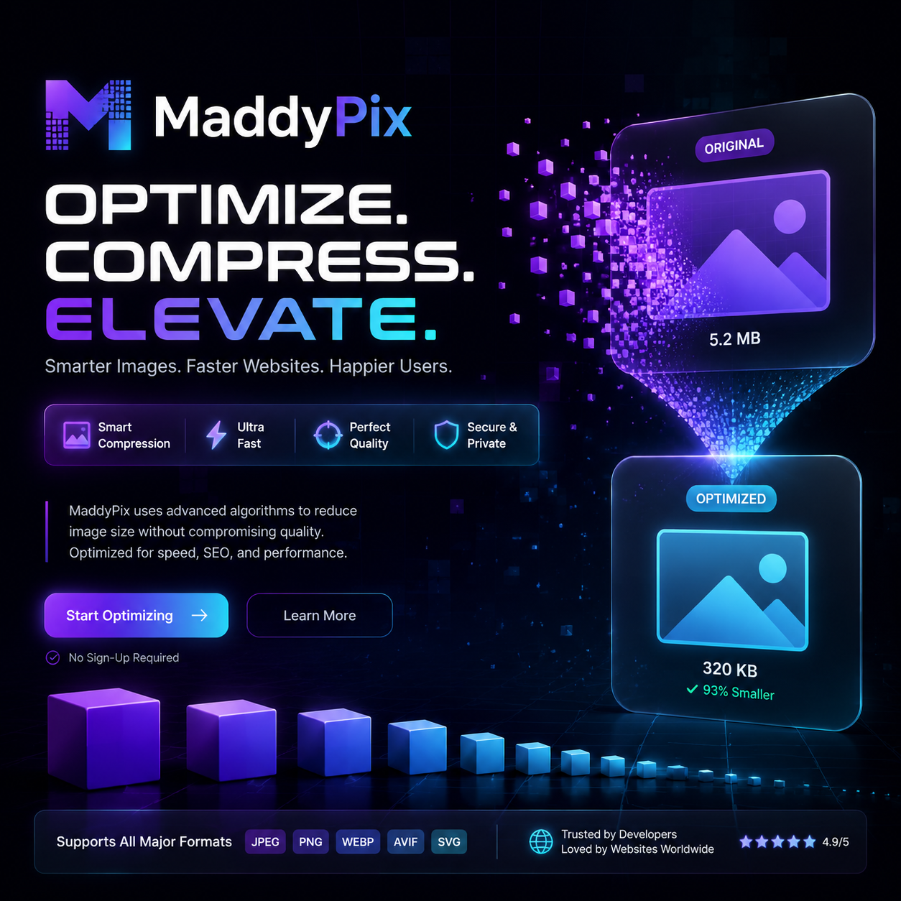

<p align="center">
  
  
  
  
</p>

<p align="center">
  <picture>
    <source media="(prefers-color-scheme: dark)" srcset="https://raw.githubusercontent.com/Maddyrampant/MaddyPix/main/.github/banner-dark.svg">
    
  </picture>
</p>

<h1 align="center">MaddyPix</h1>
<p align="center"><strong>Compress · Resize · Convert · Filter — All in Your Browser. 100% Private. Zero Uploads.</strong></p>
<p align="center">Two-tab layout • 6 languages • 20+ features • Dark/Light theme</p>

<p align="center">
  <a href="#features">Features</a> •
  <a href="#getting-started">Getting Started</a> •
  <a href="#usage">Usage</a> •
  <a href="#keyboard-shortcuts">Shortcuts</a> •
  <a href="#languages">Languages</a> •
  <a href="#tech-stack">Tech Stack</a> •
  <a href="#license">License</a>
</p>

## 📸 Screenshots

| Editor Tab | Export Tab |
|------------|------------|
|  |  |

---

## ✨ Features

MaddyPix is a feature-rich, client-side image optimization tool built entirely with vanilla JavaScript. Every operation runs **locally in your browser** — no files are ever uploaded to a server. The UI is organized into two clean tabs (**Edit** and **Export**) to keep everything tidy and accessible.

### Core
| # | Feature | Description |
|---|---------|-------------|
| 1 | **Batch Processing** | Upload and manage multiple images at once with a visual thumbnail strip |
| 2 | **Quality Control** | Fine-tune compression from 1% to 100% with real-time feedback |
| 3 | **Lossless Mode** | Preserve every pixel with lossless PNG/WebP export |
| 4 | **Metadata Stripping** | Remove EXIF and metadata to shrink file size further |

### Transform
| # | Feature | Description |
|---|---------|-------------|
| 5 | **Resize** | Set custom width/height with locked aspect ratio |
| 6 | **Crop Presets** | Quick aspect-ratio cropping (1:1, 4:3, 16:9, 3:2, 9:16, Free) |
| 7 | **Rotate** | 90°, 180°, 270° rotation with one click |
| 8 | **Flip** | Horizontal and vertical mirror transforms |

### Output
| # | Feature | Description |
|---|---------|-------------|
| 9 | **Format Conversion** | Convert between JPEG, PNG, WebP, BMP, and GIF |
| 10 | **Progressive JPEG** | Enable progressive/interlace encoding for faster perceived loading |
| 11 | **Target File Size** | Automatically adjust quality to hit a specific KB target using binary-search optimization |
| 12 | **Base64 Export** | Generate and copy a Base64 data URL for inline embedding |

### Filters & Effects
| # | Feature | Description |
|---|---------|-------------|
| 13 | **Pixel Filters** | Grayscale, Sepia, and Invert applied at the pixel level |
| 14 | **CSS Filters** | Brightness, Contrast, Blur, and Saturate with adjustable intensity |

### Watermark & Branding
| # | Feature | Description |
|---|---------|-------------|
| 15 | **Text Watermark** | Overlay customizable text with position presets (center, corners) and size options |

### Viewing & Comparison
| # | Feature | Description |
|---|---------|-------------|
| 16 | **Split View** | Side-by-side comparison of original vs processed |
| 17 | **Slider View** | Interactive before/after slider — drag to compare |
| 18 | **Single View** | Full-window preview with zoom support |

### Productivity
| # | Feature | Description |
|---|---------|-------------|
| 19 | **Keyboard Shortcuts** | Full keyboard navigation: Process, Download, Reset, History, Info, Theme |
| 20 | **Processing History** | Complete log of all compressions with size savings, timestamps, and clear option |
| _bonus_ | **Clipboard Copy** | Copy processed image directly to system clipboard |
| _bonus_ | **Batch Download** | Download all images as a ZIP archive |
| _bonus_ | **Image Info Panel** | Detailed metadata: format, dimensions, file size, color space, compression ratio |
| _bonus_ | **Dark/Light Theme** | Toggle between dark and light UI themes |

---

## 🚀 Getting Started

No installation required. MaddyPix is a single HTML file that runs entirely in the browser.

### Option 1: Open directly

```bash
# Clone the repo
git clone https://github.com/Maddyrampant/MaddyPix.git

# Open in your browser
open MaddyPix/index.html
```

### Option 2: Use GitHub Pages

Visit **[https://Maddyrampant.github.io/MaddyPix](https://Maddyrampant.github.io/MaddyPix)** (once Pages is enabled).

### Option 3: Host it yourself

Drop `index.html` on any static file server (NGINX, Netlify, Vercel, S3, etc.) and you're done.

---

## 🎯 Usage

1. **Drop** images onto the upload zone or click to browse (multiple files supported).
2. **Adjust** quality, resize dimensions, format, filters, and watermark settings.
3. **Click** <kbd>⚡ Process</kbd> or press <kbd>Space</kbd>.
4. **Compare** using Split, Slider, or Single view.
5. **Download** the result — or copy to clipboard / get Base64.

### Batch Workflow

- Upload multiple images — they appear as thumbnails in the bottom strip.
- Click any thumbnail to switch active image.
- Process each image individually or click **Download All** to get a ZIP.

---

## ⌨️ Keyboard Shortcuts

| Key | Action |
|-----|--------|
| <kbd>Space</kbd> | Process current image |
| <kbd>S</kbd> | Download processed image |
| <kbd>R</kbd> | Reset rotation / flip |
| <kbd>H</kbd> | Open processing history |
| <kbd>I</kbd> | Show image info panel |
| <kbd>T</kbd> | Toggle dark/light theme |
| <kbd>L</kbd> | Cycle through languages |

---

## 🌐 Languages

MaddyPix ships with full UI translations in **6 languages**, auto-detected RTL/LTR direction, and a persistent language preference.

| Language | Code | Direction | Flag |
|----------|------|-----------|------|
| English | `en` | LTR | 🇬🇧 |
| Persian (Farsi) | `fa` | **RTL** | 🇮🇷 |
| Arabic | `ar` | **RTL** | 🇸🇦 |
| French | `fr` | LTR | 🇫🇷 |
| German | `de` | LTR | 🇩🇪 |
| Russian | `ru` | LTR | 🇷🇺 |

Switch anytime from the header dropdown. Your choice is saved to `localStorage`.

---

## 🧱 Tech Stack

| Layer | Technology |
|-------|-----------|
| **Core** | Vanilla JavaScript (ES2020+) |
| **Canvas** | HTML5 Canvas 2D API |
| **Compression** | `canvas.toBlob()` with quality parameter |
| **Binary Search** | Custom optimizer for target file size |
| **ZIP** | [JSZip](https://stuk.github.io/jszip/) (lazy-loaded on demand) |
| **Font** | [Inter](https://rsms.me/inter/) via Google Fonts |
| **Icons** | Unicode / Emoji (zero dependencies) |

---

## 📊 Browser Support

| Chrome | Firefox | Safari | Edge | Opera |
|--------|---------|--------|------|-------|
| ✅ 90+ | ✅ 90+ | ✅ 15+ | ✅ 90+ | ✅ 80+ |

---

## 🤝 Contributing

Contributions are welcome! Since MaddyPix is a single-file app, just:

1. Fork the repo
2. Edit `index.html`
3. Open a Pull Request

Please keep the file self-contained (no build step, no dependencies).

---

## 📄 License

MIT © [Maddyrampant](https://github.com/Maddyrampant)

---

<p align="center">
  <strong>Made with ❤️ for the web. Zero servers. Zero tracking. Zero uploads.</strong>
</p>
